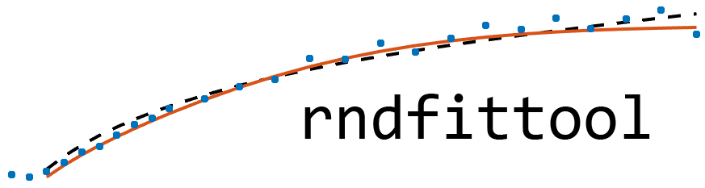

<p align="center">

</p>
Risk-neutral Density Fitting Tool

## Getting Started

The _Risk-neutral Density Fitting Tool_ tool allows the user to infer the risk-neutral density (RND), the risk-neutral moments and the greeks embedded in a set of observed call and put option prices. The underlying  methodology is fully non-structural, meaning that it does not rely on any parametric model, and it consists in approximating the RND through orthogonal polynomial expansions. A detailed description of this methodology can be found <a href="https://papers.ssrn.com/sol3/papers.cfm?abstract_id=2943964">here</a>.
This tool is <b>not</b> a standalone software but fully relies on the MATLAB suite.

### Prerequisites

This code has been thoroughly tested on MATLAB R2015b and partially on versions R2016b, R2014a and R2014b. However, it is very likely that it runs on other versions of MATLAB.
The following MATLAB Toolboxes are required to ensure full compatibility of the code: 

- Curve Fitting Toolbox
- Financial Toolbox
- Optimization Toolbox
- Statistics and Machine Learning Toolbox

### Installing

There are two options to install the Risk-neutral Density Fitting Tool on your machine.

#### Installation as MATLAB App (recommended)
- Double-click on the file to start the installation process.
- If the double-click does not work you may alternatively open the file by dragging it into the MATLAB command window.
- After the installation is done the Risk-neutral Density Fitting Tool icon will be listed among your MATLAB Apps.
- If the installation does not work switch to the next method.

#### Installation as MATLAB App (recommended)
- Extract the archive contents into a local folder.
- Set the folder containing the extracted file as MATLAB current folder or add it to the MATLAB path list. 
- Type <code>rndfittool</code> to run the tool.

## Quick usage

Explain what these tests test and why

```
Give an example
```

## Screenshots


## About the software

### Version
17.04
### Author
[**Andrea Barletta**](http://pure.au.dk/portal/en/persons/id(e161f76b-35b6-4903-b768-e8b172cbede5).html)
### Acknowledgments
[**Paolo Santucci de Magistris**](https://sites.google.com/universitadipavia.it/paolosantuccidemagistris/home) provided great contribuition to the project with the implementation of the PCA and with testing.
