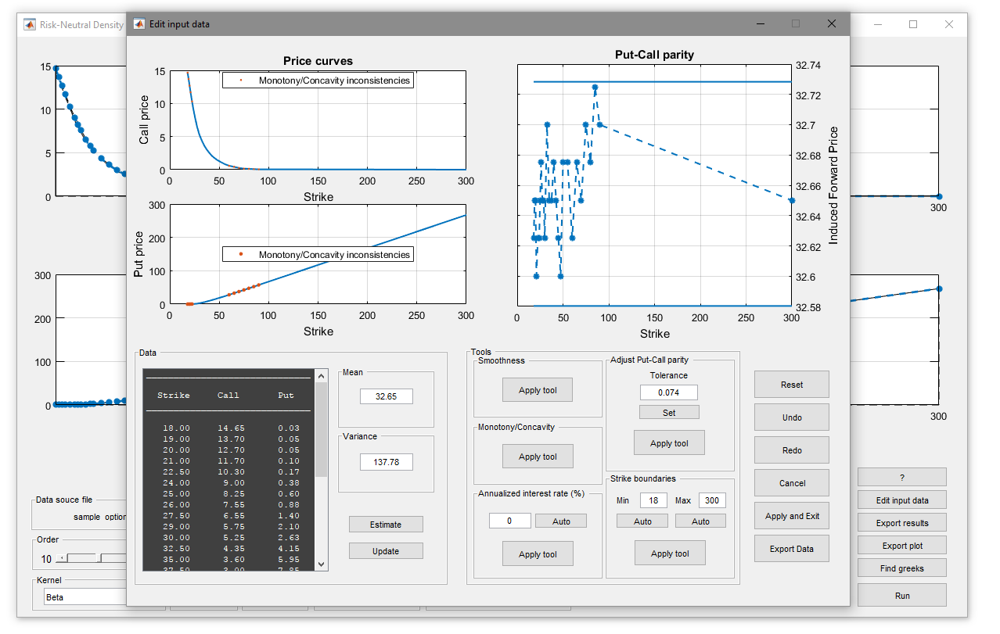
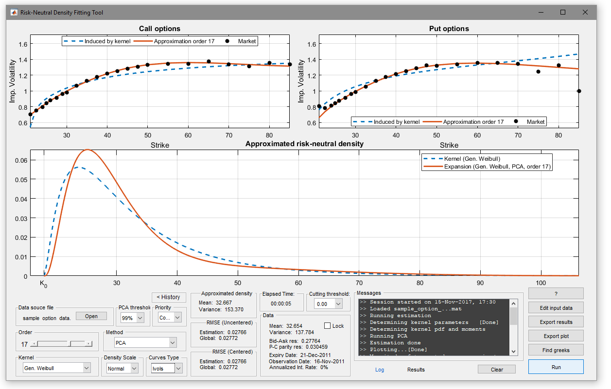
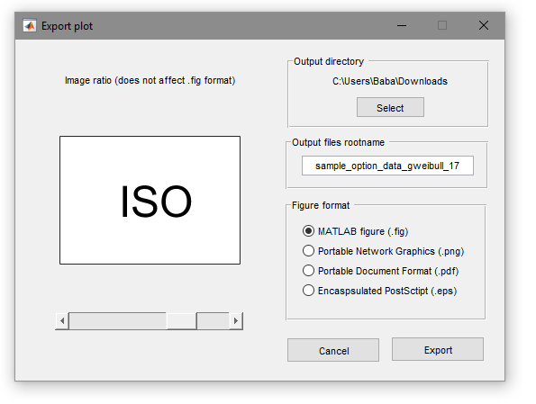

<p align="center">

</p>

## Getting Started

The _Risk-neutral Density Fitting Tool_ tool allows the user to infer the risk-neutral density (RND), the risk-neutral moments and the greeks embedded in a set of observed call and put option prices. The underlying  methodology is fully non-structural, meaning that it does not rely on any parametric model, and it consists in approximating the RND through orthogonal polynomial expansions. A detailed description of this methodology can be found <a href="https://papers.ssrn.com/sol3/papers.cfm?abstract_id=2943964">here</a>.
This tool is <b>not</b> a standalone software but fully relies on the MATLAB suite.

### Prerequisites

This code has been thoroughly tested on MATLAB R2015b and partially on versions R2016b, R2014a and R2014b. However, it is very likely that it runs on other versions of MATLAB.
The following MATLAB Toolboxes are required to ensure full compatibility of the code: 

- Curve Fitting Toolbox
- Financial Toolbox
- Optimization Toolbox
- Statistics and Machine Learning Toolbox

### Installing

There are two options to install the Risk-neutral Density Fitting Tool on your machine.

#### Installation as MATLAB App (recommended)
- Download the MATLAB App installer from [here](https://github.com/abarletta/rndfittool/releases/download/v17.04/RND.Fitting.Tool.mlappinstall).
- Double-click on the file to start the installation process.
- If the double-click does not work you may alternatively open the file by dragging it into the MATLAB command window.
- After the installation is done the Risk-neutral Density Fitting Tool icon will be listed among your MATLAB Apps.
- If the installation does not work switch to the next method.

#### Installation as MATLAB App (recommended)
- Download the zip archive from [here](https://github.com/abarletta/rndfittool/releases/download/v17.04/RND.Fitting.Tool.zip).
- Extract the archive contents into a local folder.
- Set the folder containing the extracted file as MATLAB current folder or add it to the MATLAB path list. 
- Type <code>rndfittool</code> to run the tool.

## Quick usage

- Load input data. Native formats from OptionMetrics and CBOE are supported (see below).

<p align="center">

</p>

- Infer risk-neutral mean and variance through <code>Edit input data</code>. Press <code>Edit input data</code> to validate your changes. Change strike boundaries (you may need to repeat this step in case the fitting is not satisfactory). Press <code>Apply tool</code> and <code>Apply and Exit</code> to save all changes and return to the main window.

<p align="center">

</p>

- Choose order (e.g. 11), kernel (e.g. Gen. Weibull) and method (e.g. PCA, 99%, constrained).

<p align="center">

</p>

- Press <code>Find greeks</code> to compute the greeks (still without using a model).

<p align="center">

</p>

- All plots and results can be exported through <code>Export plots</code> and <code>Export results</code>.

<p align="center">

</p>

## Supported data sources

The standard compatible format for input data is a MAT-file with the following structure (see also <code>sample_option_data.mat</code> in the repository)

```
Variable name: [Size Type]
            K: [Mx1 double]  -----
         call: [Mx1 double]       | Mandatory
          put: [Mx1 double]       |
            m: [2x1 double]  -----
      obsDate: [1x6 int]     -----
      expDate: [1x6 int]          |
       call_a: [Mx1 double]       | Optional
       call_b: [Mx1 double]       |
        put_a: [Mx1 double]       |
        put_b: [Mx1 double]  -----
```

#### Mandatory variables:

- <code>K</code> vector of strike values
- <code>call</code> vector of observed call prices
- <code>put</code> vector of observed put prices
- <code>m</code> vector containing guessed mean and variance (can be set to [])

#### Optional variables:

- <code>obsDate</code> observation date in numeric format 'yyyy mm dd'
- <code>expDate</code> expiry date in numeric format 'yyyy mm dd'
- <code>call_a</code> vector of call ask prices
- <code>call_b</code> vector of call bid prices
- <code>put_a</code> vector of put ask prices
- <code>put_b</code> vector of put bid prices

### External sources

Input data can also be loaded from external sources and optionally converted into compatible MAT-file format. Note that normally loading MAT-formatted data is faster.

#### OptionMetrics

Option data must have .xls, .xlsx or .csv extension and formatted with all default options (e.g. date format) preset in the OptionMetrics download page. All columns related to mandatory variables must be contained in the dataset. Other field can be appended at any position of the spreadsheet. Options with several maturities and/or observation dates can be collected into the same file, in this case the user will be asked to make a choice.

Website: http://www.optionmetrics.com/

#### CBOE

Data may be saved either into default .dat format available at CBOE website or may be pre-converted into .xls/.xlsx format. Data must contain all fields related to mandatory variables. Additional fields can be appended in any position of the dataset. Data for several maturities can be collected into the same file, in this case the user will be asked to choose a maturity when loading data.

Website: http://www.cboe.com/delayedquote/quote-table

## About the software

### Version
17.04
### Author
[**Andrea Barletta**](http://pure.au.dk/portal/en/persons/id(e161f76b-35b6-4903-b768-e8b172cbede5).html)
### Acknowledgments
[**Paolo Santucci de Magistris**](https://sites.google.com/universitadipavia.it/paolosantuccidemagistris/home) provided great contribuition to the project with the implementation of the PCA and with testing.
